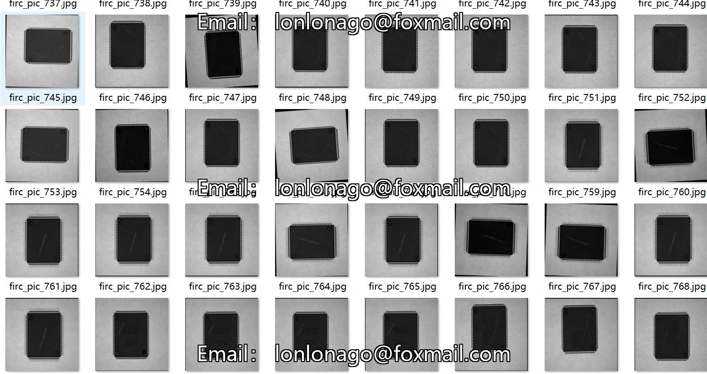
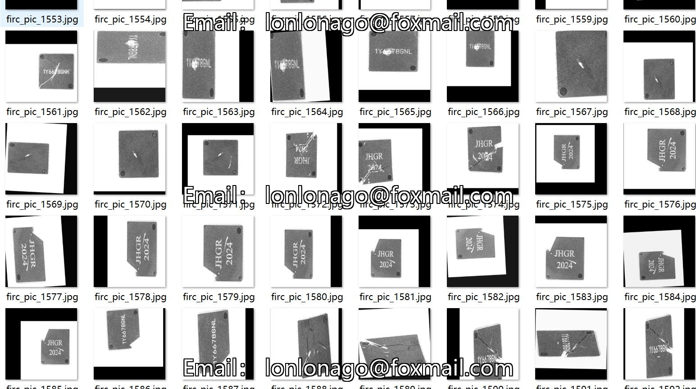
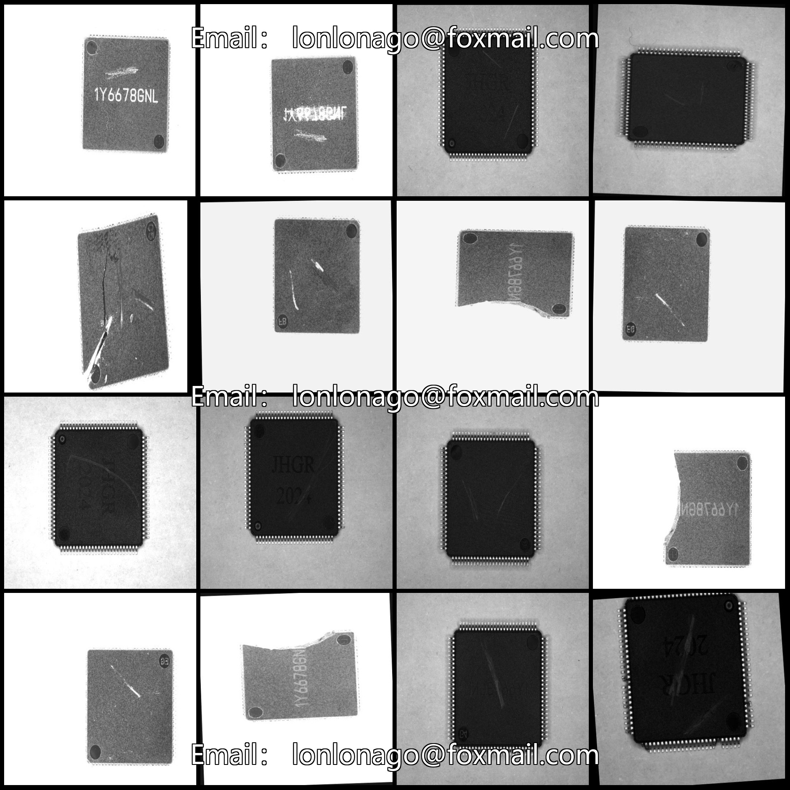
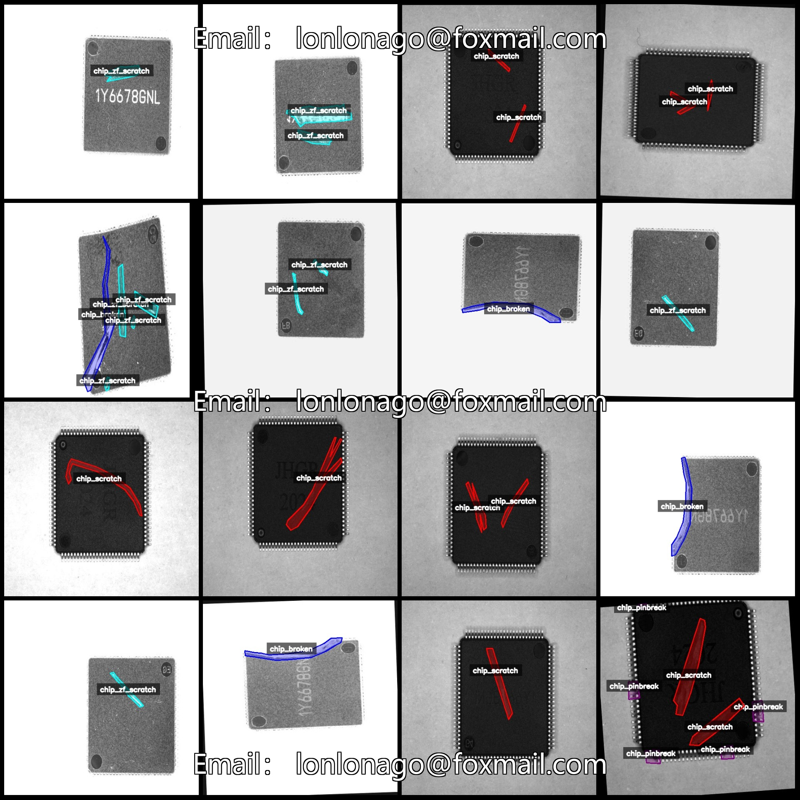
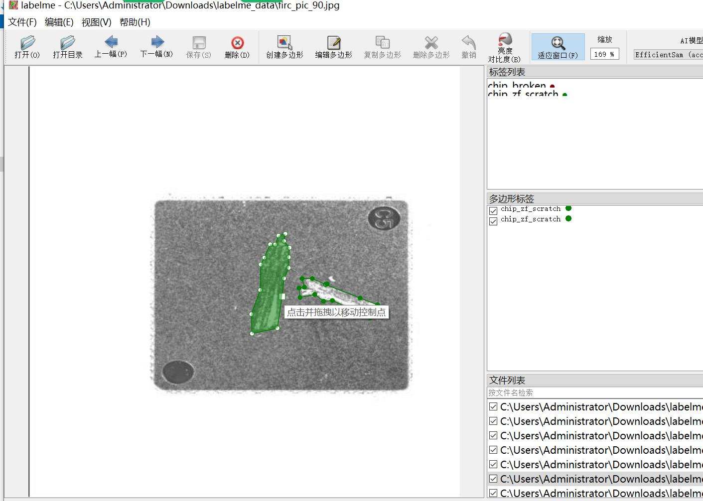

# Semiconductor Chip Surface Scratches, Pin Breaks, and Fracture Defects Recognition and Segmentation Data Set (labelme)

Please note that the dataset contains a large number of rotated enhanced images.

Dataset format: labelme (without mask files, only including jpg images and corresponding json files)

Number of images (number of jpg files): 1776
Number of annotations (json file count): 1776
Number of annotation categories: 4
Annotation categories: ["chip_broken", "chip_pinbreak", "chip_scratch", "chip_zf_scratch"]
Number of boxes for each category:
- chip_broken (Chip Broken) count = 446
- chip_pinbreak (Chip Pinbreak) count = 816
- chip_scratch (Chip Scratch) count = 1323
- chip_zf_scratch (ZF Scratch on Chip) count = 1286
Total boxes: 3871

Labeling tool used: labelme=5.5.0

Image resolution: 512x512

Annotation rules: Polygons are drawn around the categories.

Important Notice: The dataset can be opened and edited using labelme, but the json dataset needs to be converted into mask or yolo format or coco format for semantic segmentation or instance 
segmentation.

Special Statement: This dataset does not guarantee any accuracy in the training model or weight files.

Image previews:

Annotation examples:

Original images (randomly selected 16 images):

Annotation drawing results:

## Images

Here is a pay link on Stripe ( https://buy.stripe.com/3cs8yP7sY87d0vu9AB ). Please contact me lonlonago@foxmail.com after funding $89, and I will send you a complete data files , thank you!

